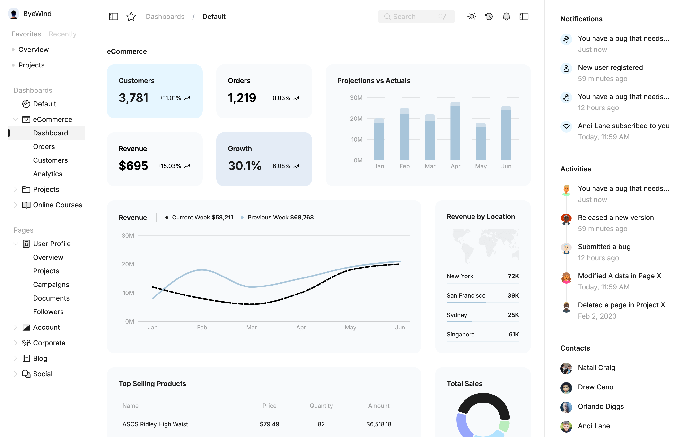
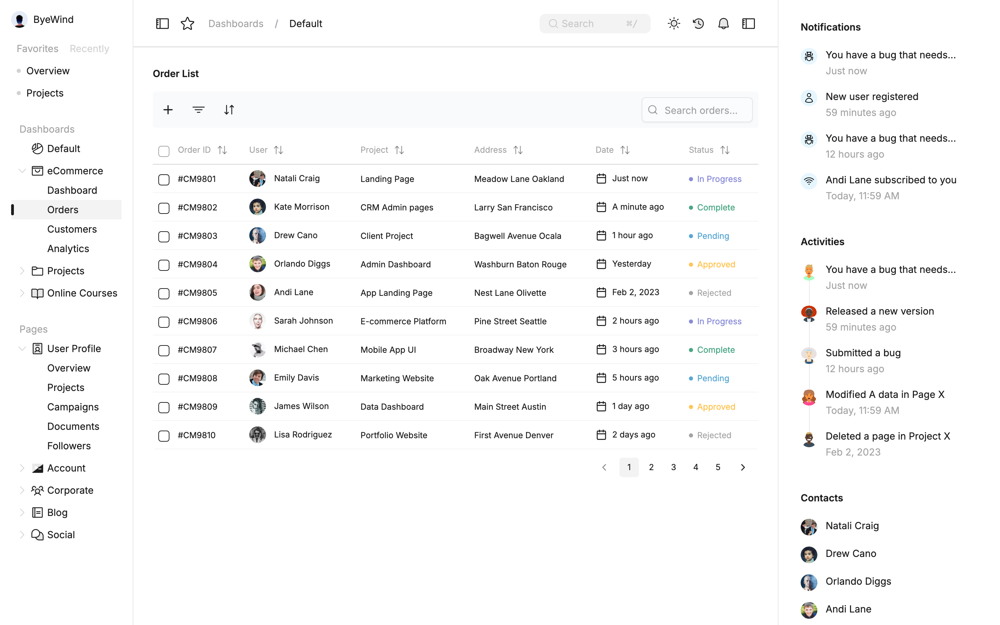

# React Dashboard

A pixel-perfect build of the **ByeWind eCommerce dashboard** design, with a server-paginated orders table and dark mode.

**[Live demo →](https://react-dashboard-psi-three.vercel.app)**





## Features

- **Dashboard:** KPI cards, projections vs actuals bar chart, revenue line chart, revenue by location map, top products table, total sales donut chart
- **Orders:** server-side pagination, sorting, filtering, search and row selection
- **Light and dark themes**
- **Collapsible sidebars** for navigation, notifications and activity
- Loading, empty and error states

## Tech stack

React 18 · Vite · React Query · TanStack Table · Recharts · shadcn/ui (Radix) · Tailwind CSS · React Router

## How it's structured

```
src/
├── api/          # data fetching, one file per feature
├── components/
│   ├── charts/       # bar, line, pie, world map
│   ├── dashboard/    # metric cards, revenue + projection charts
│   ├── layout/       # sidebars, header
│   └── ui/           # shadcn/ui primitives
├── config/       # constants, navigation, query client
├── contexts/     # theme and layout state
├── hooks/        # reusable logic
└── pages/        # Dashboard, Orders
```

- **Server state lives in React Query** (caching, pagination). UI state such as theme and sidebars lives in context.
- **API calls are kept in `api/`**, so components only render.
- **Routes are code-split** with `React.lazy`.

## Run locally

```bash
npm install
npm run dev
```

Open http://localhost:5173 for the dashboard and `/ecommerce/orders` for orders.

## Credits

UI design by [ByeWind](https://www.figma.com/community/file/1288200489613010131) (Figma community).
